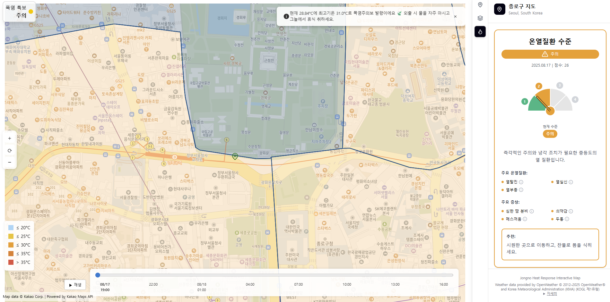

# Jongno Heat Response Interactive Map

Welcome to the Jongno Heat Response Interactive Map! This project provides a modern, user-friendly web application to help residents and visitors in Jongno, Seoul, stay safe and informed during hot weather.

## Live Demo

*   **Frontend (Vercel):** [https://jongno-heat-map-frontend.vercel.app](https://jongno-heat-map-frontend.vercel.app)
*   **Backend (Hugging Face Spaces):** [https://huggingface.co/spaces/your-username/jongno-heat-map-backend](https://huggingface.co/spaces/your-username/jongno-heat-map-backend)

## Features

*   **Interactive Map:** Explore a dynamic map of Jongno, Seoul.
*   **Real-time Weather:** Get current weather conditions, hourly forecasts, and official heat warnings from the Korea Meteorological Administration (KMA).
*   **Cooling Centers:** Easily locate nearby cooling centers, with options to filter by facility type.
*   **AI Chatbot:** Ask our AI assistant for advice on heat-related illnesses, prevention, and first aid.
*   **Heat Illness Guide:** An interactive guide to understand the different stages of heat-related illnesses and their symptoms.
*   **Responsive Design:** Fully accessible on both desktop and mobile devices.

## Screenshots

### Map Layers - Example 1

### Map Layers - Example 2

### Map Layers - Example 3

## Technologies Used

### Frontend
*   React, TypeScript, Vite, Tailwind CSS, Kakao Maps API

### Backend
*   FastAPI, Python, Uvicorn, FriendliAI

## Development

This project was developed with assistance from AI. For information on how to contribute or set up a local development environment, please see the project's wiki or contact the maintainers.

## License

This project is open-source and available under the [MIT License](https://opensource.org/licenses/MIT). It incorporates data from OpenWeather, KMA, Kakao Maps, SGIS, and the Seoul Metropolitan Government.