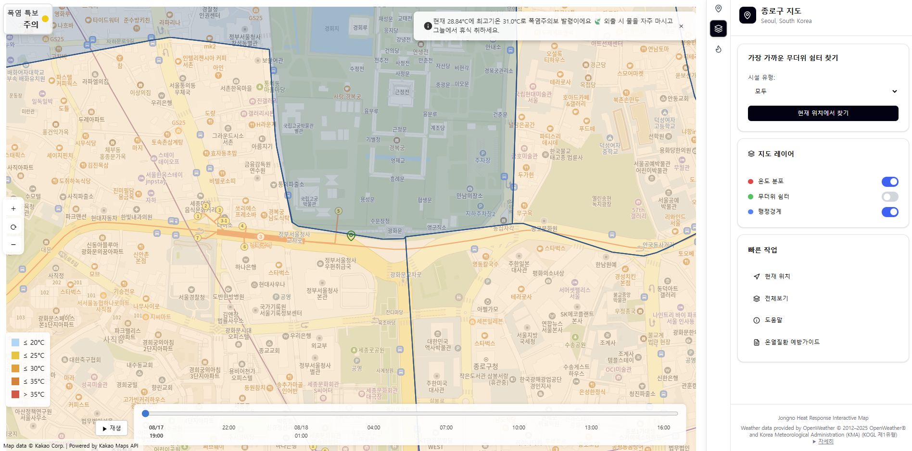

# Jongno Heat Response Interactive Map

This project provides a modern web interface for exploring Jongno (Seoul) map data, including weather information, temperature extremes, and cooling center locations. It features both desktop and mobile-friendly interfaces.

## Features

### Map & Location
- Interactive map of Jongno, Seoul.
- Display of current location on the map.
- Ability to pan the map to a specific location.

### Weather Information
- Current weather display for the selected map location.
- Hourly temperature forecasts.
- KMA (Korea Meteorological Administration) weather warnings, with visual indicators for heat advisories.
- Comparison of today's and yesterday's maximum temperatures with visual difference indicators.

### Cooling Centers
- Find the closest cooling center to the user's current location.
- Filter cooling centers by facility type (e.g., public facilities, facilities for specific groups).
- Map pans to the closest found cooling center.

### AI Chat
- Provides AI-generated advice and information about heat-related illnesses, prevention, and treatment.
- Utilizes a RAG (Retrieval-Augmented Generation) system to answer questions based on pre-processed PDF documents.
- The chat feature utilizes the `K-intelligence/Midm-2.0-Base-Instruct` model.

### Heat Illness Guide Enhancements

The Heat Illness Guide has been enhanced with interactive elements to provide more detailed information:

-   **Interactive Symptoms**: Each symptom now reveals additional details (`extraInfo`) when hovered over or clicked. A small info icon (ⓘ) visually indicates the presence of this extra information.
-   **Interactive Main Heat Illness**: The main heat illness listed for each stage now also provides expanded information (including details on conditions like Heat Syncope and Heat Edema) when hovered over or clicked. An info icon (ⓘ) serves as a visual cue.
-   **Interactive First Aid**: First aid instructions are now interactive, displaying further details upon hover or click, accompanied by an info icon (ⓘ).

### User Interface
- Responsive design for both desktop and mobile devices.
- Sidebar for detailed information and controls on desktop.
- Mobile menu for quick actions and navigation.

## Technologies Used

### Frontend
- **React**: JavaScript library for building user interfaces.
- **TypeScript**: Superset of JavaScript that adds static typing.
- **Vite**: Fast build tool for modern web projects.
- **Tailwind CSS**: Utility-first CSS framework for rapid UI development.
- **Lucide React**: Icon library.
- **React Toastify**: For toast notifications.
- **Day.js**: Lightweight JavaScript date library.
- **Kakao Maps API**: For map functionalities.

### Backend
- **FastAPI**: Modern, fast (high-performance) web framework for building APIs with Python 3.7+.
- **Uvicorn**: ASGI server for running FastAPI applications.
- **APScheduler**: Advanced Python scheduler for running periodic tasks (e.g., hourly KMA data updates).
- **Requests**: HTTP library for making external API calls.
- **python-dotenv**: For managing environment variables.
- **Pydantic**: Data validation and settings management using Python type hints.
- **OpenAI**: Python client for interacting with OpenAI-compatible APIs (used for AI chat).
- **FriendliAI**: Used to accelerate the AI model for chat responses.

## Getting Started

### Prerequisites

Make sure you have the following installed on your system:

- [Node.js](https://nodejs.org/) (LTS version recommended)
- [Python](https://www.python.org/) (3.9+)

### Installation and Running

1.  **Clone the repository:**

    ```bash
    git clone https://github.com/igoobo/Jongno-Heat-Response-Interactive-Map.git
    cd Jongno-Heat-Response-Interactive-Map
    ```

2.  **Set up the Backend:**

    -   Navigate to the `backend` directory:
        ```bash
        cd backend
        ```
    -   Create a virtual environment and activate it:
        ```bash
        # On Windows
        python -m venv .venv
        .venv\Scripts\activate

        # On macOS/Linux
        python3 -m venv .venv
        source .venv/bin/activate
        ```
    -   Install the required Python packages:
        ```bash
        pip install -r requirements.txt
        ```
    -   **Preprocess data for AI Chat:**
        This step is crucial for the AI chat functionality. It extracts text from PDF documents, creates embeddings, and builds a FAISS index.
        ```bash
        python preprocess.py (Optional)
        ```
    -   Create a `.env` file in the `backend` directory and add your API keys:
        ```
        KAKAO_REST_API_KEY=your_kakao_rest_api_key
        OPENWEATHER_API_KEY=your_openweathermap_api_key
        KMA_API_KEY=your_kma_api_key
        FRIENDLI_TOKENS=your_friendli_ai_token # New API Key
        ```

3.  **Set up the Frontend:**

    -   Navigate to the `frontend` directory:
        ```bash
        cd ../frontend
        ```
    -   Install the required npm packages:
        ```bash
        npm install
        npm run build
        ```
        Create a `.env` file in the `frontend` directory and add your API keys:
        ```
        VITE_KAKAO_MAP_JS_API_KEY=YOUR_KAKAO_APP_KEY_HERE
        ```
4.  **Run the Application:**

    -   **Start the backend server:** In your terminal, from the **project root directory**, activate your backend virtual environment, and run:
        ```bash
        # On Windows
        .venv\Scripts\activate
        python -m uvicorn backend.main:app --host 0.0.0.0 --port 8000

        # On macOS/Linux
        source .venv/bin/activate
        python3 -m uvicorn backend.main:app --host 0.0.0.0 --port 8000
        ```
    -   **Start the frontend development server:** Open a **new** terminal, navigate to the `frontend` directory, and run:
        ```bash
        npm run dev
        ```

    Your application should now be running and accessible at `http://localhost:5173` (or another port if 5173 is busy).

## Folder Structure

```
. (project root)
├── backend/
│   ├── data/                 # JSON data files (e.g., cooling centers, geojson)
│   ├── documents/            # PDF documents used for AI chat preprocessing
│   ├── storage/              # Stores preprocessed data (FAISS index, text chunks) for AI chat, generated by `preprocess.py`
│   ├── services/             # Backend service modules
│   ├── .env.example          # Example environment variables for backend
│   ├── .env                  # Environment variables (API keys - ignored by Git)
│   ├── api_clients.py        # External API fetching logic
│   ├── cache.py              # Global cache for KMA warnings
│   ├── main.py               # FastAPI application entry point, scheduler setup
│   ├── requirements.txt      # Python dependencies
│   └── routes.py             # API endpoints
├── frontend/
│   ├── public/               # Static assets (icons, images)
│   ├── src/                  # Frontend source code
│   │   ├── assets/           # React/Vite specific assets
│   │   ├── common/           # Common types (e.g., Kakao Maps) and libraries
│   │   ├── components/       # Reusable UI components (e.g., Card, Button, Slider)
│   │   ├── context/          # React Context providers for global state
│   │   ├── features/         # Core application features, organized by domain
│   │   │   ├── map/          # Map components, hooks, and controls
│   │   │   ├── sidebar/      # Desktop and mobile sidebar components
│   │   │   └── weather/      # Weather display components and hooks
│   │   ├── hooks/            # Global custom React hooks
│   │   ├── services/         # Functions for calling external services (e.g., Kakao)
│   │   ├── stores/           # Client-side state management (e.g., Zustand)
│   │   ├── styles/           # Global CSS
│   │   └── utils/            # Utility functions
```

## Screenshots

### Map Layers - Example 1


### Map Layers - Example 2


### Map Layers - Example 3


## AI Assistance

This project was developed with the assistance of AI models, specifically Google Gemini and ChatGPT, Figma Make. 
These tools were utilized for various aspects of the development process, including:
- Generating code snippets and boilerplate.
- Debugging and troubleshooting errors.
- Explaining complex concepts and best practices.
- Refactoring existing code for improved structure and maintainability.
- Providing recommendations for architectural patterns and library choices.

The use of AI accelerated the development workflow and provided valuable insights throughout the project.

## License

This project incorporates data and services from various sources, each with its own licensing terms:

- **Weather Data (Current & Forecast)**: Provided by OpenWeather © 2012–2025 OpenWeather®.
- **Weather Data (KMA)**: Provided by Korea Meteorological Administration (KMA) under KOGL Type 1 (공공누리 제1유형).
- **Map Data**: © Kakao Corp. | Powered by Kakao Maps API.
- **Statistical Geographic Information**: Provided by SGIS (Statistical Geographic Information Service) - https://sgis.kostat.go.kr/developer/html/main.html.
- **Cooling Centers Data**: Provided by Seoul Metropolitan Government under KOGL Type 1 license - https://data.seoul.go.kr/dataList/OA-21065/S/1/datasetView.do.

This project is open-source and available under the [MIT License](https://opensource.org/licenses/MIT).
